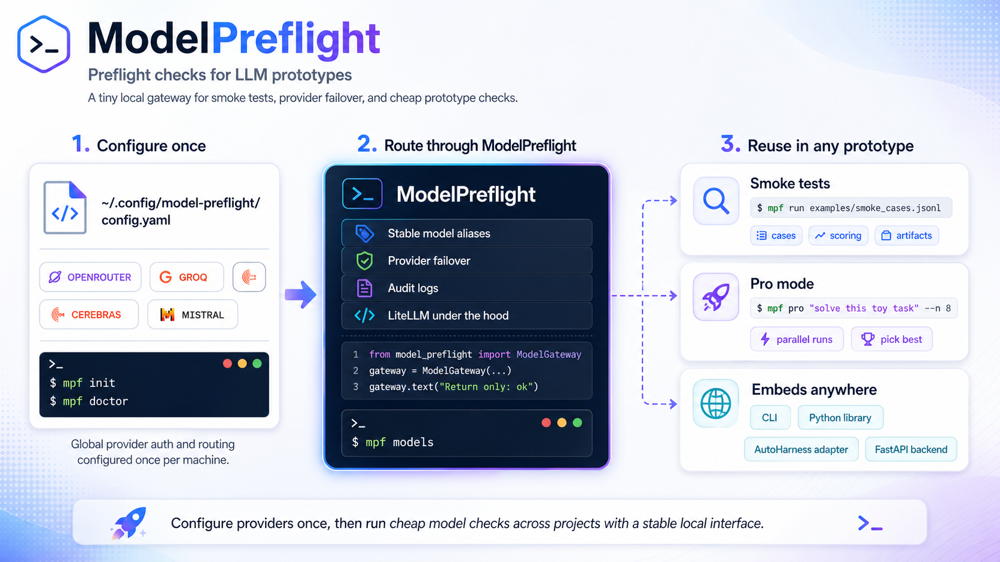

<div align="center">

#  **ModelPreflight**

**Preflight checks for LLM prototypes.**

**A tiny local gateway for smoke tests, provider failover, and cheap prototype checks before you wire an LLM into something bigger.**

[](https://github.com/pylit-ai/model-preflight/actions/workflows/ci.yml)
[](https://www.python.org/downloads/)
[](https://pypi.org/project/model-preflight/)




| If you want to... | Start here |
|-------------------|------------|
| Get one green check quickly | [60-second start](#60-second-start) |
| Try it without keys | [No-key demo path](#no-key-demo-path) |
| Configure provider groups once | [Machine-local config](#machine-local-config) |
| Run project smoke cases | [Smoke tests](#smoke-tests) |
| Fan out a one-off prompt | [Pro Mode](#pro-mode) |
| Use it as a Python helper | [Library usage](#library-usage) |

---

ModelPreflight keeps provider setup **machine-local** and keeps smoke cases **project-local**. It gives prototypes stable model-group aliases, simple failover, and JSONL audit logs without becoming a benchmark harness or hosted gateway.

</div>

---

<details>
<summary> <b>Why this repo exists</b></summary>

Early LLM prototypes often need a quick answer to a practical question: "Can this prompt, model group, or provider route work well enough to keep building?"

ModelPreflight gives you a lightweight layer for that stage:

- one global config for provider credentials and routing
- project-local JSONL smoke cases
- stable aliases such as `free_reasoning` and `free_fast`
- best-effort failover through LiteLLM
- audit records for live calls

</details>

<details>
<summary> <b>When to use it</b></summary>

Use ModelPreflight when:

- a prototype needs cheap LLM smoke checks before deeper eval work
- several projects should share the same local provider setup
- you want logical groups instead of hard-coding provider/model IDs everywhere
- provider quotas, model slugs, or dev-tier availability may drift
- you need enough provenance to debug "which model answered this?"

</details>

<details>
<summary> <b>What it is not</b></summary>

ModelPreflight is not:

- a model leaderboard
- a formal benchmark framework
- a hosted inference gateway
- a provider catalog authority
- proof that an endpoint is free, fast, or available today

Bundled provider presets are starter data. Check each provider's current catalog and terms before relying on a route.

</details>

## 60-second start

```bash
uvx model-preflight --help

# In a persistent tool or project environment:
uv tool install model-preflight
# or:
pipx install model-preflight
```

Pick one provider, set one key, and run one live check:

```bash
mpf init --provider nvidia
export NVIDIA_NIM_API_KEY=...
mpf doctor --live
mpf demo
```

Expected signal:

- `mpf init --provider nvidia` writes your machine-local config and prints `next: mpf doctor --live`.
- `mpf doctor --live` prints a deployments table, then `live check ok: group=...`.
- `mpf demo` prints JSON with `"passed": true` and an empty `"failures": []` list.

Add checks to a project:

```bash
cd my-project
mpf init-project
mpf run
```

Expected signal:

- `mpf init-project` writes `evals/smoke.jsonl`, writes `.model-preflight/README.md`, and updates `.gitignore`.
- `mpf run` prints JSON results for the starter cases. Every passing case has `"passed": true`.
- A failing case exits non-zero and includes strings under `"failures"` so you know what drifted.

Both `mpf` and `model-preflight` are installed as console scripts.

ModelPreflight catches missing keys, broken provider routes, prompt formatting regressions,
output-shape drift, accidental model/provider changes, and "this worked yesterday" prototype
failures before you wire the LLM call into something larger.

## No-key demo path

Use the minimal offline preset when you want to test the CLI and project workflow without a provider
account:

```bash
mpf init --preset minimal
mpf doctor --live
mpf demo
mpf init-project
mpf run
```

What this proves:

- Config loading works without secrets.
- The CLI can run a live-style check through the offline echo provider.
- Project bootstrap works by creating `evals/smoke.jsonl`.
- Smoke scoring works when `mpf run` returns JSON where every case has `"passed": true`.

What it does not prove: remote provider auth, quota, latency, or model quality. Use the OpenRouter
path below for that.

<details open>
<summary> <b>Install options</b></summary>

**PyPI or isolated tool install**

```bash
uv tool install model-preflight
# or:
pipx install model-preflight
mpf --help
```

**Project dependency**

```bash
uv add --dev model-preflight
# or:
pip install model-preflight
```

**Editable checkout**

```bash
git clone https://github.com/pylit-ai/model-preflight.git
cd model-preflight
uv pip install -e .
# or from another repo:
uv add --dev --editable /absolute/path/to/model-preflight
```

ModelPreflight requires Python 3.11+.

</details>

---

## Machine-local config

ModelPreflight reads provider routes from `~/.config/model-preflight/config.yaml` by default. Override the path with either `--config` or `MODEL_PREFLIGHT_CONFIG`.

```bash
mpf init --provider openrouter
mpf doctor
mpf models
```

Provider setup is discoverable from the CLI:

```bash
mpf providers list
mpf providers guide nvidia
mpf providers guide openrouter
mpf providers test nvidia
mpf providers test openrouter
```

NVIDIA Build / NIM is the primary high-capability open/open-weight endpoint option. OpenRouter is
still the lowest-friction discovery option because one API key can route to many model providers
through an OpenAI-compatible API.

Use either primary path:

```bash
mpf init --provider nvidia
export NVIDIA_NIM_API_KEY=...
mpf doctor --provider nvidia --live

mpf init --provider openrouter
export OPENROUTER_API_KEY=...
mpf doctor --provider openrouter --live
```

| Provider | Best for | Env var | Setup |
|----------|----------|---------|-------|
| NVIDIA Build / NIM | Primary high-capability open/open-weight endpoint pool | `NVIDIA_NIM_API_KEY` | [API keys](https://build.nvidia.com/settings/api-keys) |
| OpenRouter | One-key first run with broad model access | `OPENROUTER_API_KEY` | [Authentication docs](https://openrouter.ai/docs/api-reference/authentication) |
| Groq | Fast repeated calls after first-run setup works | `GROQ_API_KEY` | [Groq console](https://console.groq.com/keys) |
| Cerebras | Fast inference experiments when current dev-tier limits fit | `CEREBRAS_API_KEY` | [Cerebras inference docs](https://inference-docs.cerebras.ai/) |
| Mistral | First-party Mistral model-family smoke checks | `MISTRAL_API_KEY` | [Mistral API keys](https://docs.mistral.ai/getting-started/quickstart/#account-setup) |

Secondary/overflow pool to add manually once the primary pool works: Google Gemini/Gemma,
Cloudflare Workers AI, GitHub Models, Hugging Face Inference Providers, and SambaNova. These are
documented in [`docs/PROVIDER_PRESETS.md`](./docs/PROVIDER_PRESETS.md), but not packaged as
first-run presets yet because auth shape, model IDs, and free/dev limits are more account-specific.

The default config creates logical groups, then maps each group to one or more LiteLLM deployments:

```yaml
router:
  num_retries: 1
  timeout_seconds: 60
  default_group: free_reasoning
  audit_jsonl: null
artifacts_dir: ~/.cache/model-preflight/artifacts

deployments:
  - name: nvidia_nim_nemotron_3_super
    provider: nvidia
    group: free_reasoning
    model: nvidia_nim/nvidia/nemotron-3-super-120b-a12b
    api_key_env: NVIDIA_NIM_API_KEY
    enabled: true
    required: true
    status: best_effort
    setup_url: https://build.nvidia.com/settings/api-keys
    rpm: 10
    tier: reasoning
```

<details>
<summary> <b>Provider preset discipline</b></summary>

Provider presets are best-effort starter data, not authoritative claims about free availability.

- user-local config wins over bundled defaults
- `mpf doctor` fails fast when required keys are missing
- optional/disabled providers do not block first-run checks
- live checks should be opt-in in CI
- endpoint names, quotas, pricing, and behavior can change without this repo knowing

See [`docs/PROVIDER_PRESETS.md`](./docs/PROVIDER_PRESETS.md) for the preset rules.

</details>

<details>
<summary> <b>Custom config path</b></summary>

```bash
mpf init --config ./model-preflight.yaml
mpf doctor --config ./model-preflight.yaml
mpf doctor --config ./model-preflight.yaml --live

export MODEL_PREFLIGHT_CONFIG="$PWD/model-preflight.yaml"
mpf models
```

Use environment variables for secrets. Do not commit provider keys.

</details>

---

## Smoke tests

Smoke cases are JSONL files owned by the project that is doing the prototype work.

```jsonl
{"id":"basic-ok","prompt":"Return only: ok","expected_substrings":["ok"]}
{"id":"avoid-word","prompt":"Answer yes without using the word nope","forbidden_substrings":["nope"]}
```

Run them with:

```bash
mpf run
# or:
mpf run path/to/smoke_cases.jsonl
```

`mpf run` prints JSON results and exits non-zero if any case fails.

<details>
<summary><strong>Case fields</strong></summary>

Each smoke case supports:

- `id`: stable case identifier
- `prompt`: user prompt sent to the configured model group
- `group`: optional model group override
- `expected_substrings`: strings that must appear in the answer
- `forbidden_substrings`: strings that must not appear in the answer

These checks are intentionally simple. They are meant to catch obvious routing, prompt, and regression problems before you spend time on heavier evals.

</details>

---

## Pro Mode

`mpf pro` fans out a one-off prompt, then synthesizes a final answer through a judge group.

```bash
mpf pro "Suggest three robust JSON schemas for this toy extraction task" --n 8
```

Defaults:

| Option | Default | Role |
|--------|---------|------|
| `--n` | `8` | number of sampled answers |
| `--sample-group` | `free_fast` | fanout group |
| `--judge-group` | `free_reasoning` | synthesis group |

<details>
<summary> <b>Cost and quota note</b></summary>

Fanout multiplies live provider calls. Keep `--n` low while testing, use restricted provider keys where available, and review provider dashboards when running against paid endpoints.

ModelPreflight records audit rows for live calls, but it does not enforce provider billing limits beyond your configured routing and provider-side controls.

</details>

---

## Library usage

```python
from model_preflight import ModelGateway, load_config, pro_mode

gateway = ModelGateway(load_config())

print(gateway.text("Return only: ok", group="free_reasoning"))

result = pro_mode(gateway, "Solve this toy puzzle", n=8)
print(result["final"])
```

The library API is intentionally thin:

- `load_config()` reads the same machine-local config as the CLI
- `ModelGateway` wraps LiteLLM Router with stable group aliases and audit logging
- `pro_mode()` runs fanout plus synthesis for one-off prototype prompts

---

## Audit artifacts

By default, ModelPreflight writes audit logs under:

```text
~/.cache/model-preflight/artifacts/audit.jsonl
```

Each live call should be traceable enough to debug provider drift:

- timestamp
- logical group
- resolved provider/model when returned by the provider
- prompt or case metadata
- latency
- token usage when available
- response id when available

See [`docs/EVAL_PROVENANCE.md`](./docs/EVAL_PROVENANCE.md) for provenance expectations.

---

## Repo adapters

| Path | Purpose |
|------|---------|
| [`examples/autoharness_provider.py`](./examples/autoharness_provider.py) | Drop-in provider wrapper for AutoHarness-style experiments |
| [`examples/gpt_pro_mode_refactor.py`](./examples/gpt_pro_mode_refactor.py) | Example refactor from single-provider Pro Mode to shared routing |
| [`examples/node_hook_example.mjs`](./examples/node_hook_example.mjs) | CLI bridge for JS or agent-hook projects |
| [`skills/model-preflight/SKILL.md`](./skills/model-preflight/SKILL.md) | Optional coding-agent skill for consistent usage |

<details>
<summary><strong>Command reference</strong></summary>

```bash
mpf init --provider openrouter
mpf doctor --live
mpf demo
mpf init-project
mpf run
mpf providers list
mpf providers guide openrouter
mpf models
mpf pro "solve this toy task" --n 8
```

</details>

<details>
<summary><strong>Contributor workflow</strong></summary>

```bash
uv sync
uv run pytest
uv run ruff check .
uv run mypy src
```

Package metadata lives in [`pyproject.toml`](./pyproject.toml). Tests live under [`tests/`](./tests/).

</details>

---

## Design principles

- Global provider/auth/routing lives in `~/.config/model-preflight/config.yaml`.
- Project-local checks define cases, scoring, fixtures, and artifacts.
- LiteLLM handles provider-specific API quirks.
- ModelPreflight adds stable aliases, lightweight failover, and audit logs.
- Deterministic tests should run before live provider checks.

For the product scope and non-goals, see [`docs/NORTHSTAR.md`](./docs/NORTHSTAR.md).
